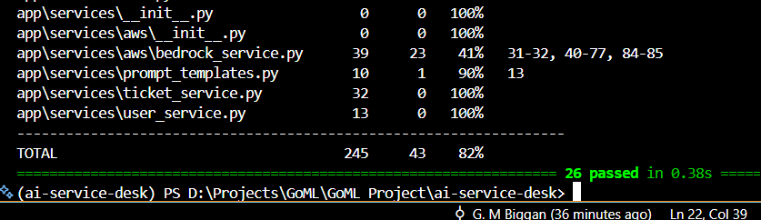
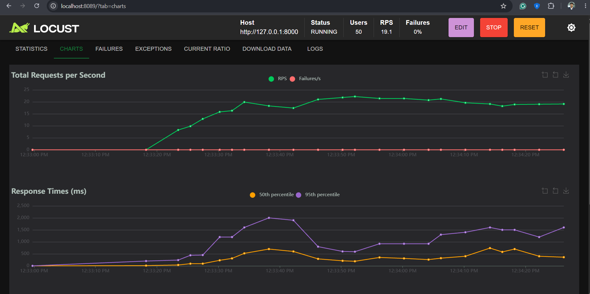
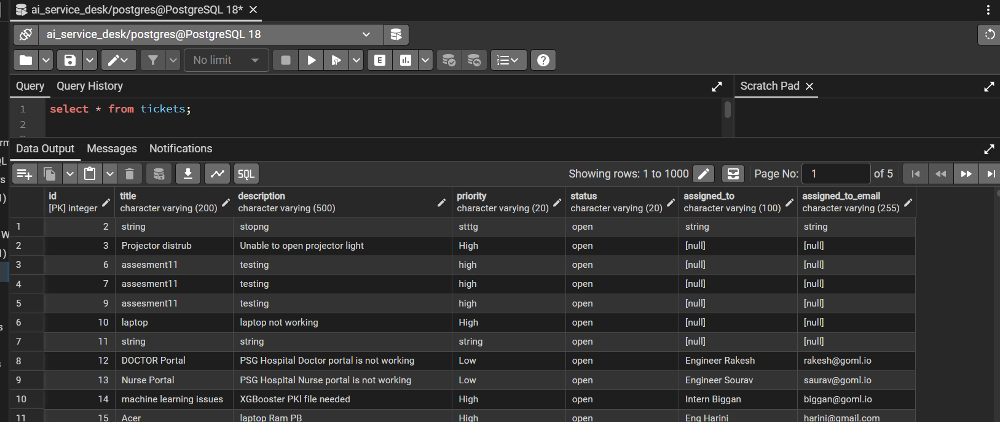
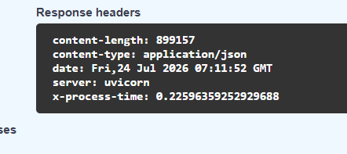
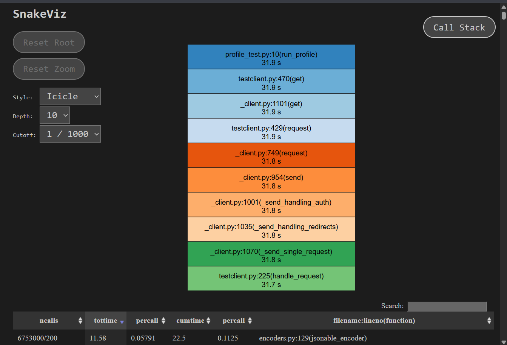

# AI Service Desk  (Backend Engineering Training Project)

# **Status:** 🚧 In Progress

# What i done ?
- FastAPI Application Development
- SQLAlchemy ORM
- PostgreSQL Database Integration
- RESTful API Design & Routing
- Database Relationships (Foundation)
- CRUD Operations (Create, Read, Update, Delete)
- Layered Architecture
- Service Layer Pattern
- Alembic Database Migration
- Middleware Implementation
- CORS Configuration
- Request Processing Time Middleware
- API Documentation using Swagger
- Pydantic Schema Validation
- AWS Bedrock AI Integration
- Health & Readiness Endpoints Check
- Unit Testing with Pytest
- Happy, Negative & Edge Case Testing
- Testing Coverage
- LOCUST Load Testing
- Profiling (cProfile + SnakeViz)
- cProfile result file save
- snakeviz Profile Graph
-

# Testing Summary
1. Unit test - 20 passed
2. Integration Testing - 6 Passed
3. Total Test Cases - 26 Passed

# tests coverage

# Locust Load Test
1. NO Failures find

# Alembic Migration for Database (PostgreSQL 18)

# Middleware Implementation & Request Processing Time

# Profiling (cProfile + SnakeViz) Graph

